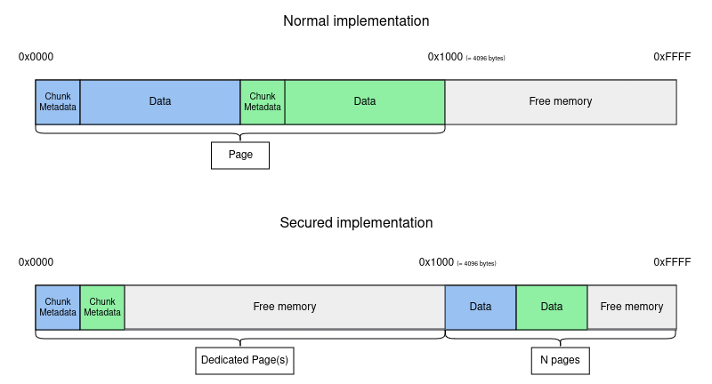

# secmalloc

## Goal

This project allows to work with :
* Linux OS and syscalls
* Memory management mechanisms
* Grap a better understanding of heap overflows

> **Note**
> It is not optimized for performances but for security.

## Roadmap

With security in mind,

- [ ] Rewrite `free`.
- [ ] Rewrite `malloc`.
- [ ] Rewrite `calloc`.
- [ ] Rewrite `realloc`.

We are constrained to use syscalls `mmap`, `munmap` and `mremap`. We also have to use ANSSI's [best practise development guide](https://cyber.gouv.fr/publications/regles-de-programmation-pour-le-developpement-securise-de-logiciels-en-langage-c).

As this is a library, we also have to make it compliant with static and dynamic linking.

## Usage

See available symbols with :

```shell
$ nm libmy_secmalloc.so | grep " T " | grep -v my_ | cut -f3 -d' ' | sort
calloc
free
malloc
realloc
```

Override default implementation in any binary :

```shell
$ LD_PRELOAD=libmy_secmalloc.so <command>
```

## Algorithm

1. We have a **data pool** gotten from a `mmap` call containing all data and canaries.
2. The **data pool** is accessible through a global variable (which its symbol is private).
3. We have a new **metadata pool** from a second `mmap` that contains a list of **data pool** descriptors.
4. For each allocated memory block, our descriptor should at least contain :
   1. A pointer to the **data pool**
   2. The state of the allocated block (busy/free)
   3. Its size
5. The **metadata pool** is also accesible through a global variable (which its symbol is also private).

A call to `malloc` will :
1. search for a descriptor in the **metadata pool** to a free block that have a big enough free space.
2. in the worst case scenario, it should create a descriptor and add it the the **metadata pool**
3. if this doesn't fit in either pool, it should resize it with `mremap`

A call to `free` will verify that :
1. the provided pointer is in our **metadata pool**
2. its descriptor points to a busy block
3. the canary at the end of the block has not been tampered (or it will provoke a stop of the process)

And it will also mark the block as free, and optionally merge two free consecutive ones.



## Features

### Logging

A function has been implemented to help in logging various events, it is based on [vsnprintf](https://cplusplus.com/reference/cstdio/vsnprintf/) and [alloca](https://man7.org/linux/man-pages/man3/alloca.3.html) functions.

### Program execution summary

The presence of the environment variable `MSM_OUTPUT` will allow generating a program execution summary. The file will be written a its contained value.

At least, tt allows tracing the following :
- Functions called (`malloc`, `free`, ...)
- Allocated blocks size
- Returned addresses

See [getenv](https://man7.org/linux/man-pages/man3/getenv.3.html)

### Malicious usage detection

The emphasis of the project is on the ability to detect memory manipulation errors and write them in the execution report:
- Heap overflow
- Double free

And if possible, detect the end of a program's execution and catch memory leaks.

### Other ideas

- [ ] Randomized canary
- [ ] Dynamic detection of an overflow through a thread watching the heap
- [ ] New algorithm handling page faults (see [userfaultfd](https://man7.org/linux/man-pages/man2/userfaultfd.2.html))
